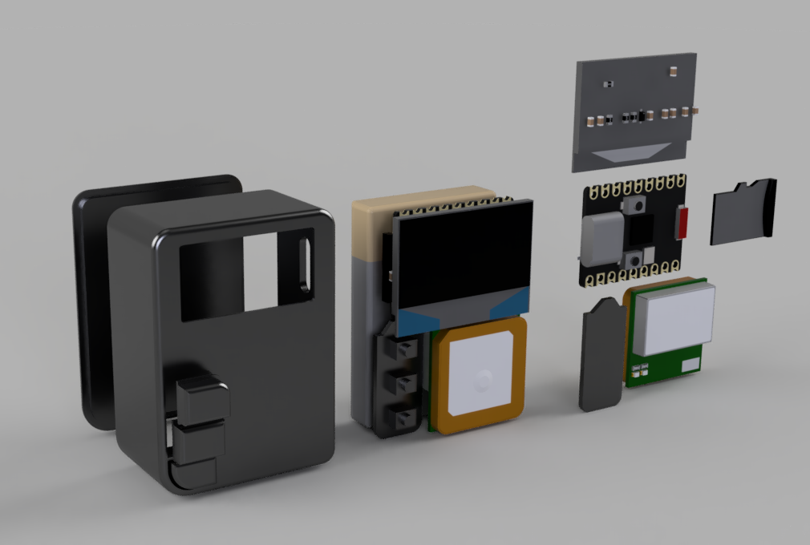
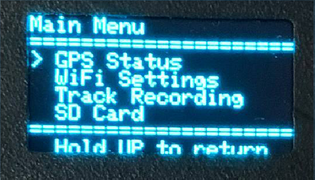
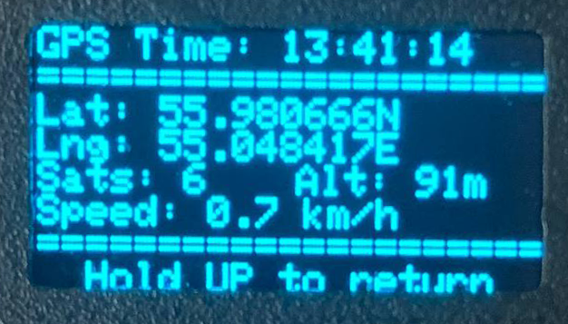
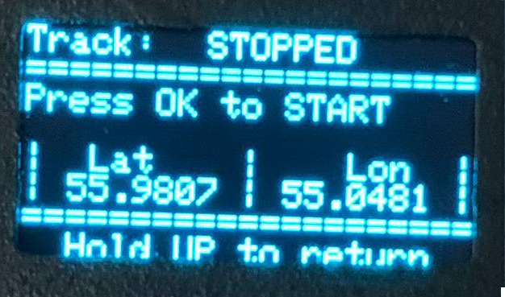
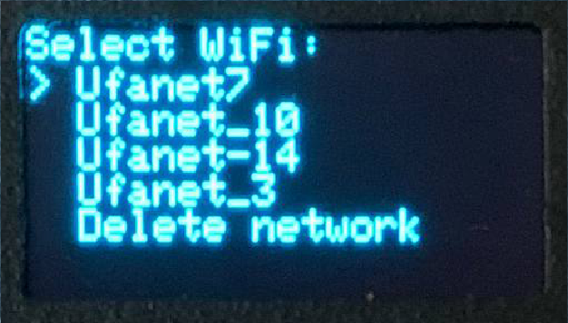
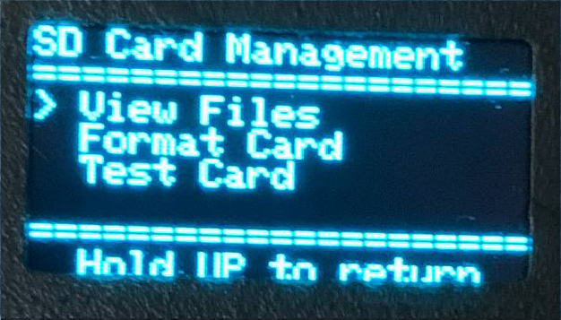
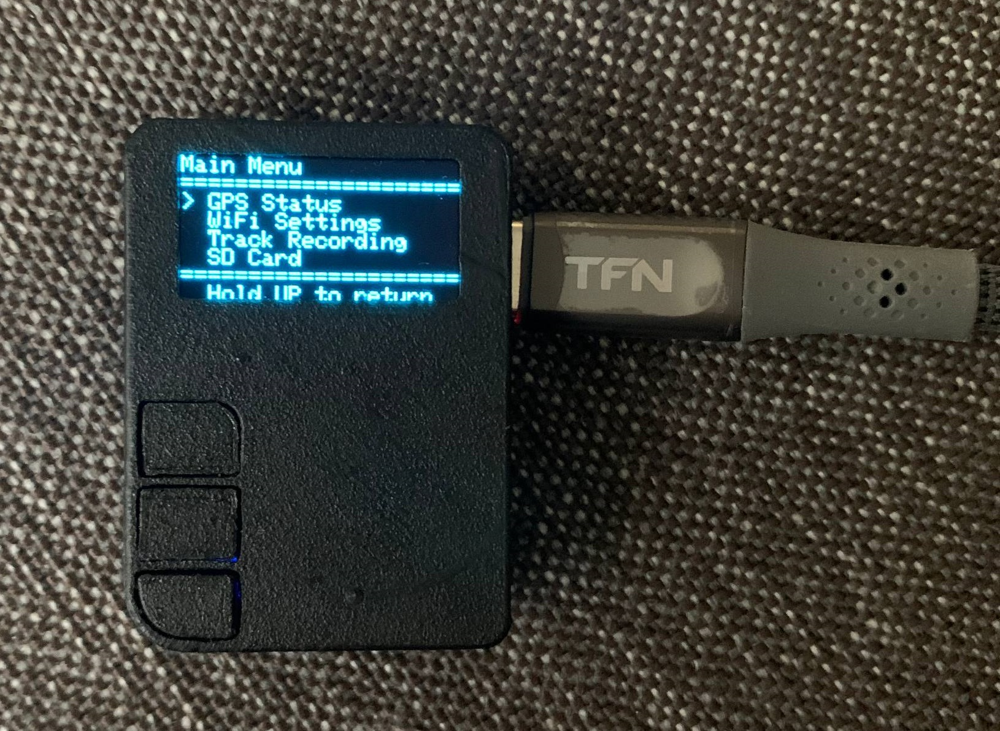
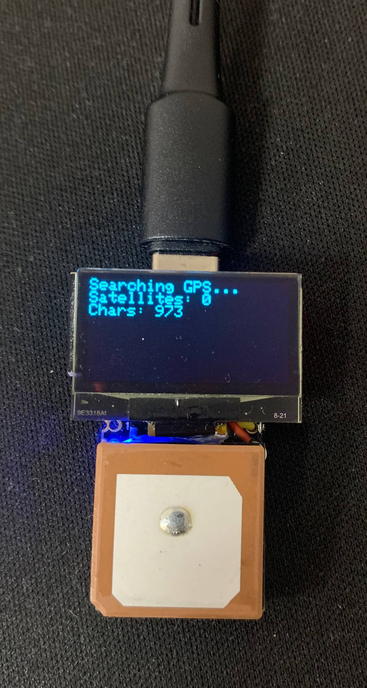
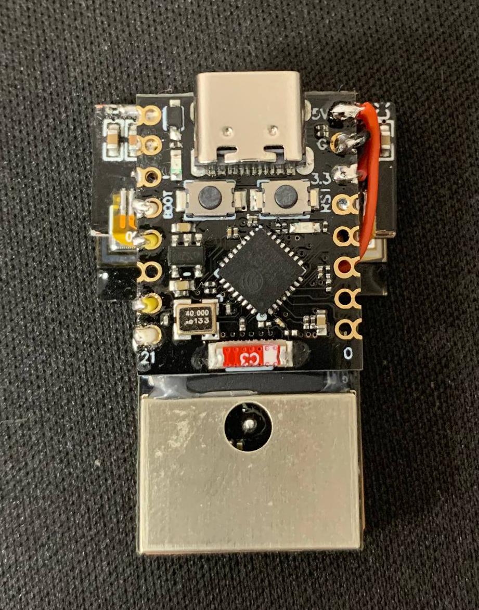
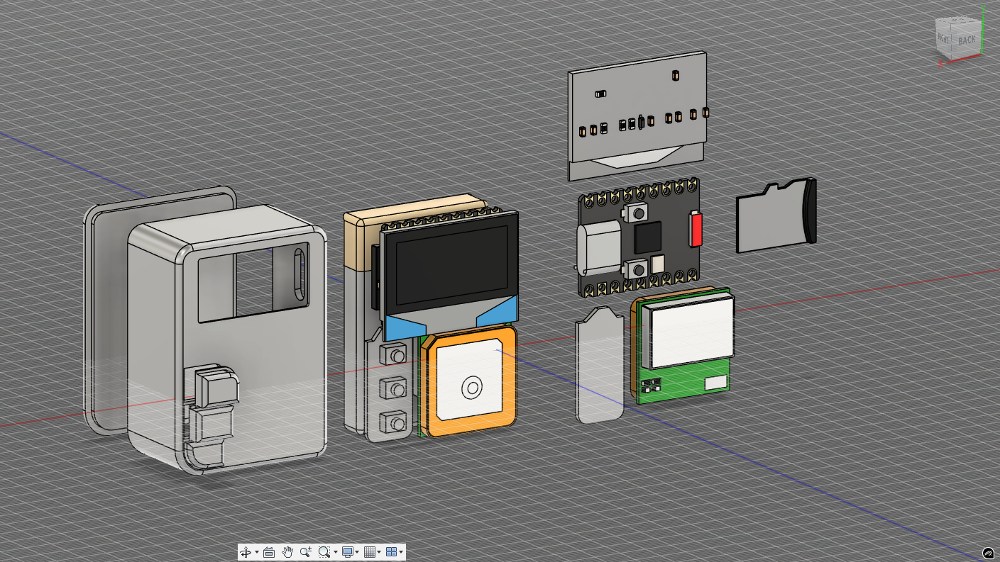

# 🛰️ GPS Tracker на ESP32

**GPS трекер с WiFi, SD картой и OLED дисплеем на базе ESP32**

[]

## 📋 Описание

Это полнофункциональный GPS трекер, разработанный на ESP32 с интуитивно понятным интерфейсом на OLED дисплее. Устройство способно записывать треки в высоком качестве, синхронизироваться с сервером через WiFi и управлять данными через удобное меню.

## Связанные проекты

- **[GPS Tracker Hardware](https://github.com/Dean7773/location_tracker)** - Сервис для просмотра маршрутов записанных при помощи GPS устройств.

## ✨ Основные возможности

### 🗺️ **GPS Трекинг**
- **Высокоточная запись** треков с фильтрацией по расстоянию (≥2м) и углу поворота (≥20°)
- **Поддержка GPS модуля** Cyclone M10-18 с автоматическим парсингом NMEA
- **Реальное время** из GPS спутников с поддержкой часовых поясов
- **Информация о спутниках** и качестве сигнала
- **Запись координат, высоты, скорости** и временных меток

### 📱 **Интерфейс и управление**
- **OLED дисплей 128x64** с четким отображением информации
- **Трехкнопочное управление** (UP/OK/DOWN) через аналоговый вход
- **Интуитивное меню** с навигацией по разделам
- **Информативные экраны** с детальной GPS информацией
- **Индикация статуса** записи и подключений

### 💾 **Хранение данных**
- **SD карта** для локального хранения треков
- **JSON формат** треков для совместимости с веб-сервисами
- **Управление файлами** - просмотр, удаление, форматирование
- **Тестирование SD карты** с диагностикой

### 🌐 **WiFi и синхронизация**
- **Автоматическое сканирование** и подключение к WiFi сетям
- **Сохранение до 3 сетей** в EEPROM с автоматическим переподключением
- **JWT авторизация** на сервере для безопасной передачи данных
- **Отправка треков чанками** для надежной передачи больших файлов
- **API интеграция** с веб-сервером для синхронизации данных

### 🔧 **Технические особенности**
- **Умная фильтрация точек** для оптимизации размера треков
- **Расчет расстояний и углов** поворота для точной записи
- **Обработка ошибок** и восстановление после сбоев
- **Энергоэффективность** с оптимизированным кодом
- **Модульная архитектура** для легкого расширения функций

## 🖼️ Интерфейс устройства

### Главное меню


*Главное меню с навигацией по основным разделам*

### GPS информация


*Детальная информация GPS: координаты, спутники, время, скорость*

### Запись трека


*Интерфейс записи трека с индикацией количества точек*

### WiFi настройки


*Управление WiFi подключениями и синхронизация с сервером*

### SD карта


*Управление файлами на SD карте*

## 🔌 Аппаратная часть

### Компоненты
- **ESP32** (любая совместимая плата)
- **GPS модуль** Cyclone M10-18 (или совместимый)
- **OLED дисплей** 128x64 (SSD1306)
- **SD карта модуль** с поддержкой SPI
- **3 кнопки** для управления (через делитель напряжения)

### Схема подключения

```
ESP32 Pinout:
├── GPIO0  → Аналоговый вход кнопок (ADC1_CH1)
├── GPIO7  → SD Card CS (Chip Select)
├── GPIO20 → GPS RX (ESP32 RX ← GPS TX)
├── GPIO21 → GPS TX (ESP32 TX → GPS RX)
├── SDA    → OLED SDA
├── SCL    → OLED SCL
└── 3.3V/GND → Питание модулей
```

### Кнопки (делитель напряжения)
```
3.3V ─┬─ R1 ─┬─ UP Button ─┬─ GND
      │       │             │
      ├─ R2 ─┼─ OK Button ─┤
      │       │             │
      └─ R3 ─┴─ DOWN Button ┘
              │
              └─ GPIO0 (ADC)
```

## 🖥️ Внешний вид устройства



*Готовое устройство в корпусе с включенным дисплеем*
*Это макет, спроектированный на коленке, дизайн будет полностью изменен*

### Детали корпуса


*Части корпуса с размещением компонентов*

## 🚀 Установка и настройка

### 1. Установка Arduino IDE и библиотек

```cpp
// Необходимые библиотеки:
#include "EncButton.h"        // Обработка кнопок
#include <Adafruit_SSD1306.h> // OLED дисплей
#include <TinyGPS++.h>        // GPS парсинг
#include <WiFi.h>             // WiFi ESP32
#include <HTTPClient.h>       // HTTP клиент
#include <ArduinoJson.h>      // JSON обработка
#include <SD.h>               // SD карта
```

### 2. Настройка конфигурации

Отредактируйте `firmware/config.h`:

```cpp
// Настройка сервера
#define SERVER_URL "http://your-server.com:8000"

// Настройка пинов (при необходимости)
#define GPS_RX 20
#define GPS_TX 21
#define SD_CS_PIN 7
```

### 3. Прошивка устройства

1. Подключите ESP32 к компьютеру
2. Откройте `firmware/gps_tracker.ino` в Arduino IDE
3. Выберите плату ESP32 Dev Module
4. Загрузите прошивку

### 4. Первый запуск

1. Вставьте отформатированную SD карту
2. Включите устройство
3. Дождитесь GPS фикса (может занять 1-2 минуты)
4. Настройте WiFi через меню
5. Авторизация на сервере (требуется только для отправки треков)

## 🔧 Настройка и калибровка

### Калибровка кнопок
Измерьте напряжения на GPIO0 при нажатии кнопок и обновите в `config.h`:
```cpp
#define UP_MIN 1307    // Минимальное значение для UP
#define UP_MAX 1507    // Максимальное значение для UP
#define OK_MIN 2750    // Минимальное значение для OK
#define OK_MAX 2950    // Максимальное значение для OK
#define DOWN_MIN 4080  // Минимальное значение для DOWN
#define DOWN_MAX 4180  // Максимальное значение для DOWN
```

### Настройка фильтрации треков
В `tracks.ino` можно изменить параметры фильтрации:
```cpp
if (dist >= 2.0) {          // Минимальное расстояние между точками (метры)
  shouldWrite = true;
}
if (angle >= 20.0) {        // Минимальный угол поворота (градусы)
  shouldWrite = true;
}
```

## 📈 Производительность

### Характеристики записи
- **Точность GPS**: до 1-3 метров (зависит от условий)
- **Частота записи**: адаптивная (2м или 20° поворота)
- **Размер трека**: ~500 точек на км (зависит от маршрута)
- **Время работы**: 4-5 часов записи (с батареей 1000mAh)

### Объем данных
- **1 час записи**: ~5000 точек (~570 KB)
- **SD карта 1GB**: ~1,800 часов записи (75 дней)
- **Чанк для отправки**: 50 точек (~5.6 KB)

## 🛠️ Разработка и расширение

### Структура проекта
```
gps_tracker/
├── firmware/
│   ├── gps_tracker.ino    # Основной файл
│   ├── config.h           # Конфигурация
│   ├── menu.ino           # Интерфейс меню
│   ├── gps.ino            # GPS функции
│   ├── tracks.ino         # Запись и отправка треков
│   ├── wifi.ino           # WiFi управление
│   ├── sd.ino             # SD карта функции
│   └── auth.ino           # Авторизация
├── docs/
│   └── images/            # Скриншоты интерфейса
└── README.md
```

## 🐛 Устранение неполадок

### Частые проблемы

**GPS не получает фикс:**
- Проверьте подключение GPS модуля
- Убедитесь в наличии видимости неба
- Подождите 2-3 минуты для холодного старта

**SD карта не читается:**
- Проверьте формат (FAT32)
- Убедитесь в правильном подключении SPI
- Попробуйте другую SD карту

**WiFi не подключается:**
- Проверьте правильность пароля
- Убедитесь в поддержке 2.4GHz сети
- Перезагрузите устройство

**Кнопки не реагируют:**
- Проверьте делитель напряжения
- Откалибруйте значения в config.h
- Проверьте подключение к GPIO0

## 📝 Лицензия

Этот проект распространяется под лицензией MIT. См. файл [LICENSE](LICENSE) для подробностей.

## 🤝 Участие в разработке

Приветствуются любые улучшения! Для участия:

1. Сделайте Fork проекта
2. Создайте ветку для новой функции
3. Внесите изменения и протестируйте
4. Отправьте Pull Request

## 📞 Поддержка

Если у вас есть вопросы или предложения:
- Создайте Issue в GitHub
- Опишите проблему максимально подробно
- Приложите скриншоты и логи если возможно
- Напишите в тг: https://t.me/wlkks

## 🎯 Планы развития

- [ ] Энергосбережение и режимы сна
- [ ] Bluetooth интерфейс для настройки
- [ ] Поддержка дополнительных GPS форматов
- [ ] Веб-интерфейс для управления
- [ ] Мобильное приложение
- [ ] Поддержка LoRaWAN для дальней связи

---

**Создано с ❤️ для сообщества разработчиков GPS решений**